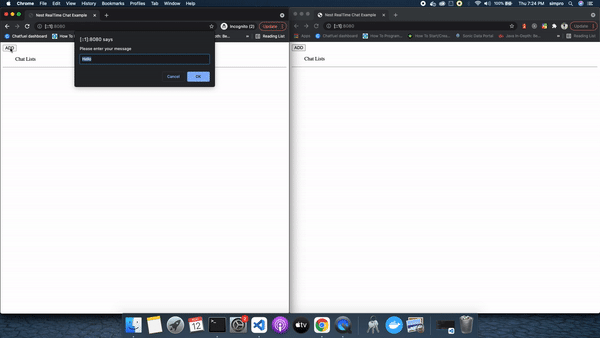
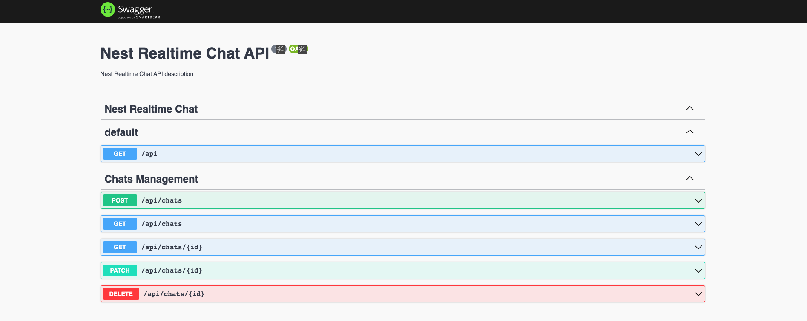

# NEST REALTIME CHAT AND REST API

This repo will demonstrate how to create REST API and convert it into Real Time App Gateway using socket.io


## Example


## Swagger API


## Installation

```bash
$ npm install
```

## Running the app

```bash
# development
$ npm run start

# watch mode
$ npm run start:dev

# production mode
$ npm run start:prod
```
- Website URL: http://localhost:8080

- Swagger-API: http://localhost:8080/swagger-api


## Stay in touch

- Author - [Prabin Karki](https://github.com/githubprabin143)
- Website - [https://prabin-karki.com.np](https://prabin-karki.com.np)

## License

Nest is [MIT licensed](LICENSE).
